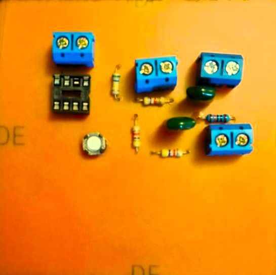

# Electronic Oscilloscope PCB Design

A digital oscilloscope system designed using Proteus, including schematic design, PCB layout, 3D visualization, and hardware implementation.

## Project Overview

This project involved the complete design and development of an electronic oscilloscope circuit, starting from circuit schematic creation to PCB design and hardware implementation. The objective was to gain practical experience in electronic circuit design, PCB development, simulation, and hardware integration.

## Tools Used

* Proteus
* PCB Design
* Electronic Components
* Hardware Prototyping

## Features

* Complete schematic design
* PCB layout development
* 3D PCB visualization
* Hardware implementation and testing
* Circuit simulation and validation

## Documentation

📄 Project Report:

[Electronic Oscilloscope Project Report](Documentation/electronic-oscilloscope-project-report.pdf)

## Screenshots

### Schematic Design

### PCB Design

### 3D View

### Hardware Implementation

## Skills Demonstrated

* Electronic Circuit Design
* PCB Layout Design
* Proteus Simulation
* Hardware Prototyping
* Testing and Troubleshooting

## Author

Abdullah Fahd Ali
